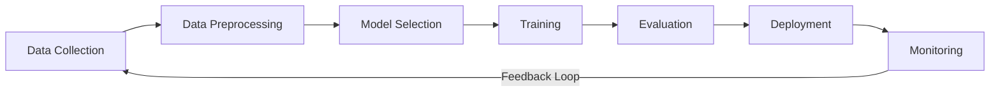

# 01 - Introduction

Welcome to the structured notes for Machine Learning. This section covers the fundamental concepts and definitions.

## 🔄 Machine Learning Lifecycle

---

[⬅️ Back to Home](README.md)
