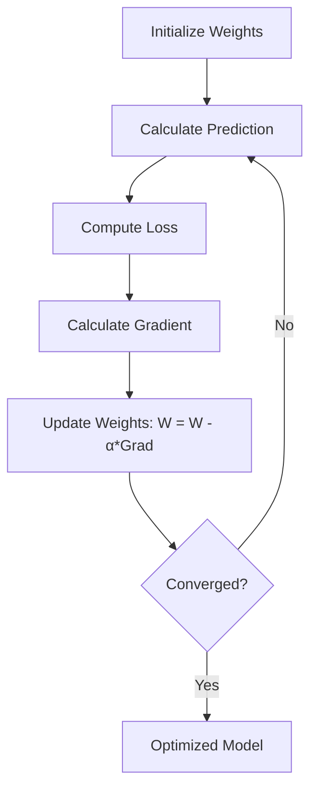

# Gradient Descent

Gradient descent is an optimization algorithm used to minimize the cost function.

## 🔄 Gradient Descent Iteration

---

[⬅️ Back to Regression Overview](README.md) | [⬅️ Back to Home](../README.md)
