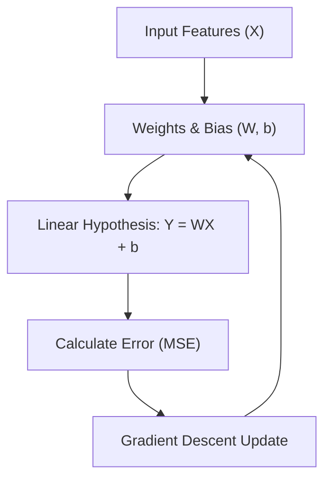

# Linear Regression

Linear regression models the relationship between a dependent variable and one or more independent variables using a linear equation.

## 📈 Linear Regression Process

---

[⬅️ Back to Regression Overview](README.md) | [⬅️ Back to Home](../README.md)
