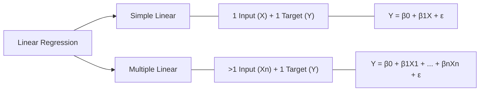
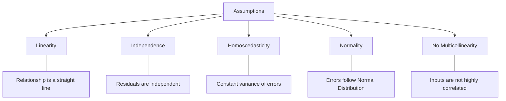
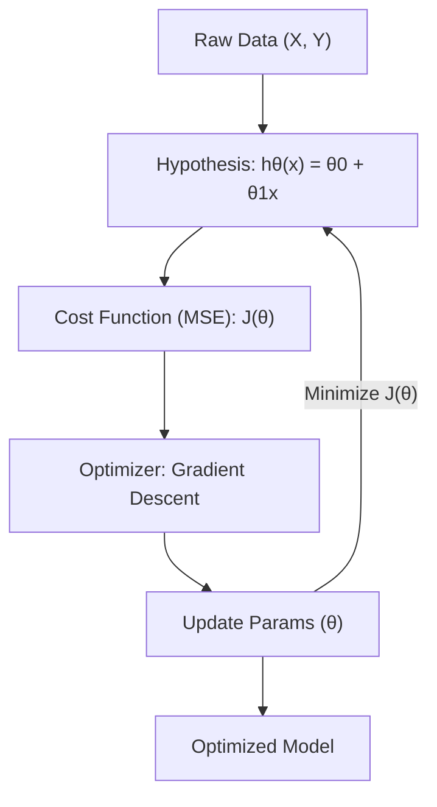

# Linear Regression

Linear regression models the relationship between a dependent variable and one or more independent variables using a linear equation.

---

## 📂 1. Types of Linear Regression

---

## 🛡️ 2. The 5 Key Assumptions

Before training, your data should meet these criteria:

---

## ⚙️ 3. Mathematical Pipeline

The flow from data to optimized model:

---

[⬅️ Back to Regression Overview](README.md) | [⬅️ Back to Home](../README.md)
