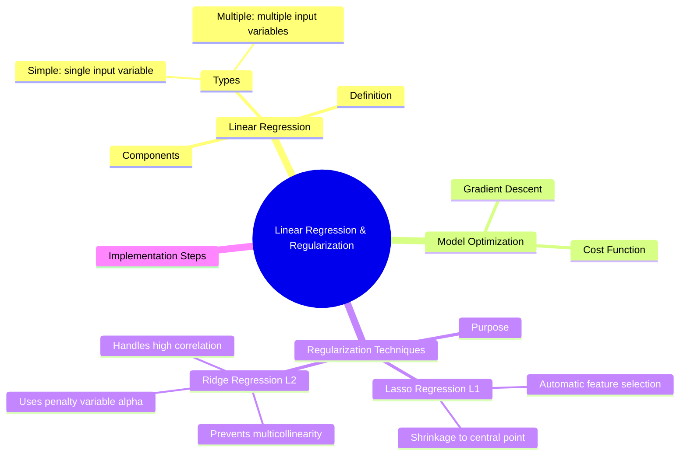

# 📈 Linear Regression & Regularization

---

## 🗺️ Visual Overview (Mind Map)

---

## 📘 1. Linear Regression
**Definition**: A statistical method to model the relationship between a dependent variable and one or more independent variables.

### 📂 Types:
- **Simple Linear Regression**: Involves a single input variable (feature) to predict the outcome.
- **Multiple Linear Regression**: Uses two or more input variables for prediction.

### 🧱 Components:
- **Hypothesis**: $h_\theta(x) = \theta_0 + \theta_1x$
- **Parameters**: $\theta_0$ (Intersept), $\theta_1$ (Slope/Weights).

---

## ⚙️ 2. Model Optimization

### 📉 Cost Function
Used to measure the error between predicted values and actual values. For Linear Regression, we typically use **Mean Squared Error (MSE)**.

### 🏃 Gradient Descent Types
Gradient Descent is the optimization algorithm used to find the values of parameters ($\theta$) that minimize the cost function.

| Type | Description | Pros | Cons |
| :--- | :--- | :--- | :--- |
| **Batch GD** | Uses the **entire dataset** to calculate the gradient for a single update. | Stable convergence / Smooth trajectory. | Very slow for large datasets; Memory intensive. |
| **Stochastic GD (SGD)** | Updates parameters using **only one training example** at a time. | Fast; Can escape local minima due to noise. | Noisy updates; Never truly converges (oscillates). |
| **Mini-Batch GD** | Updates parameters using a **small batch** (e.g., 32, 64) of data. | Balanced speed and stability; GPU optimized. | Requires tuning the batch size hyperparameter. |

---

## ⚖️ 3. Regularization Techniques
**Purpose**: To prevent **overfitting** by adding a penalty term to the cost function, discouraging the model from becoming overly complex.

### 🧶 Lasso Regression (L1)
- **Feature Selection**: Can shrink some coefficients to exactly zero, effectively removing unimportant features.
- **Shrinkage**: Pulls weights toward a central point (zero).

### 🏔️ Ridge Regression (L2)
- **Multicollinearity**: Heavily prevents issues where input variables are highly correlated.
- **Penalty Variable ($\alpha$)**: Uses a tuning parameter to control the strength of the penalty.
- **Correlation**: Handles high correlation by shrinking weights proportionally but rarely to zero.

---

## 🛠️ 4. Implementation Steps
1. **Data Collection**: Gather relevant features and targets.
2. **Preprocessing**: Handle missing values and perform **Normalization** (Feature Scaling).
3. **Model Training**: Use Gradient Descent to optimize parameters.
4. **Evaluation**: Test using metrics like R-Squared or MSE.

---

[⬅️ Back to Regression Overview](README.md) | [⬅️ Back to Home](../README.md)
