# Linear Regression

Linear regression models the relationship between a dependent variable and one or more independent variables using a linear equation.

---

## 📂 1. Types of Linear Regression

```mermaid
graph LR
    A["Linear Regression"] --> B["Simple Linear"]
    A --> C["Multiple Linear"]
    
    B --- B1["1 Input (X) + 1 Target (Y)"]
    C --- C1[">1 Input (Xn) + 1 Target (Y)"]
    
    B1 --- B2["Y = β0 + β1X + ε"]
    C1 --- C2["Y = β0 + β1X1 + ... + βnXn + ε"]
```

---

## 🛡️ 2. The 5 Key Assumptions

Before training, your data should meet these criteria:

---

## ⚙️ 3. Mathematical Pipeline

The flow from data to optimized model:

```mermaid
graph TD
    Data["Raw Data (X, Y)"] --> Hypo["Hypothesis: hθ(x) = θ0 + θ1x"]
    Hypo --> Cost["Cost Function (MSE): J(θ)"]
    Cost --> Opt["Optimizer: Gradient Descent"]
    Opt --> Update["Update Params (θ)"]
    Update -- "Minimize J(θ)" --> Hypo
    Update --> Final["Optimized Model"]
```

---

[⬅️ Back to Regression Overview](README.md) | [⬅️ Back to Home](../README.md)
