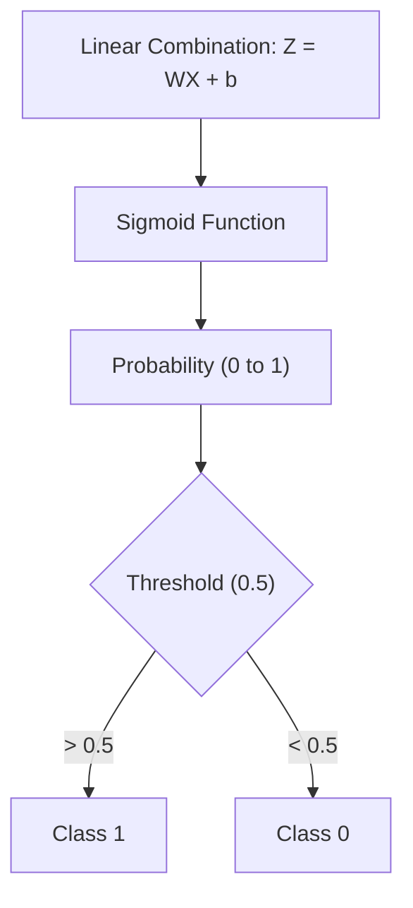

# Logistic Regression

Logistic regression is used for classification problems where the output is categorical.

## 📉 Logistic Regression Process

---

[⬅️ Back to Regression Overview](README.md) | [⬅️ Back to Home](../README.md)
