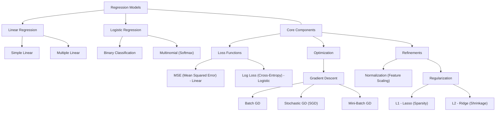

# 📉 Regression Overview

Regression is a supervised learning technique used to predict continuous numerical values (Linear) or categorical probabilities (Logistic).

---

## 🗺️ Regression Ecosystem Flowchart

---

## 🧪 Core Components Deep Dive

### 1. Loss Functions (The Goal)
Loss functions measure how far the prediction is from the target.
- **MSE (Mean Squared Error):** Used in Linear Regression. Penalizes large errors heavily.
- **Log Loss / Binary Cross-Entropy:** Used in Logistic Regression. Measures how well the predicted probability matches the label.

### 2. Optimization: Gradient Descent Types
How we reach the minimum of the loss function.
- **Batch GD:** Uses the entire dataset to update weights once. Stable but slow.
- **Stochastic GD (SGD):** Updates weights after *every* single example. Fast but noisy.
- **Mini-Batch GD:** The "Goldilocks" approach. Updates weights after a small batch of examples.

### 3. Normalization (Feature Scaling)
Ensures features are on the same scale (e.g., 0 to 1).
- **Why?** Prevents features with larger magnitudes from dominating the gradient update and helps Gradient Descent converge faster.

### 4. Regularization (Fighting Overfitting)
Adds a penalty to the loss function based on the magnitude of weights.
- **L1 (Lasso):** Shrinks some weights to exactly zero. Useful for feature selection.
- **L2 (Ridge):** Shrinks weights towards zero but not exactly. Prevents any single feature from having too much influence.

---

[⬅️ Back to Home](../README.md)
