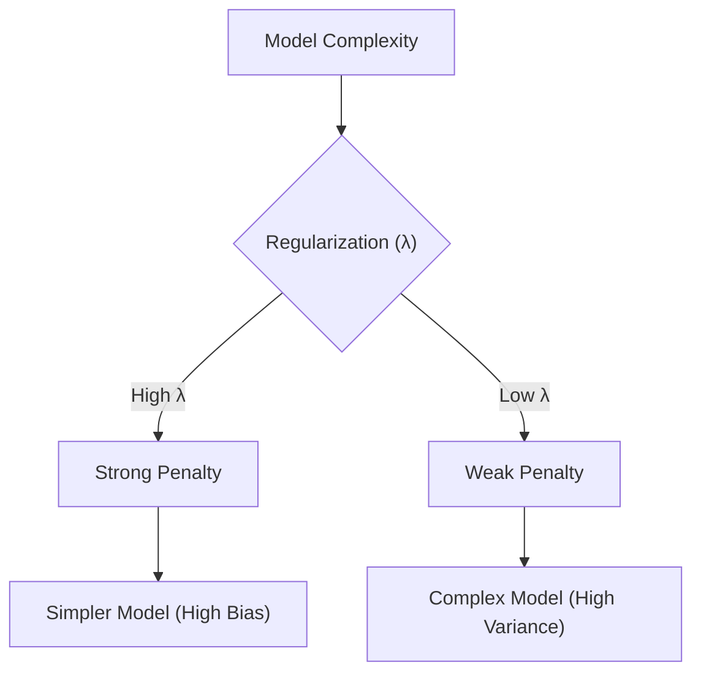

# Regularization

Regularization techniques like Ridge (L2) and Lasso (L1) are used to prevent overfitting by adding a penalty term to the cost function.

## ⚖️ Regularization: Bias-Variance Tradeoff

---

[⬅️ Back to Regression Overview](README.md) | [⬅️ Back to Home](../README.md)
