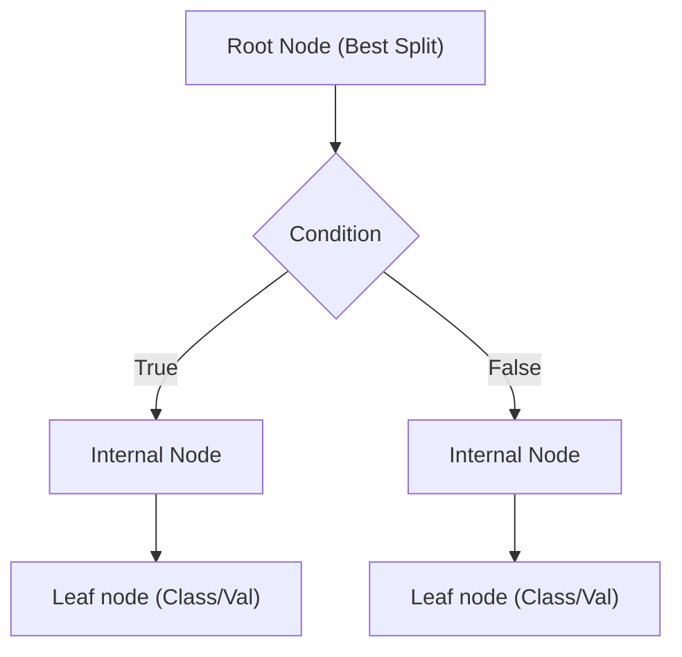

# Decision Tree

Decision trees are non-parametric supervised learning methods used for classification and regression.

## 🌳 Decision Tree Logic

```mermaid
graph TD
    A["Root Node (Best Split)"] --> B{"Condition"}
    B -- "True" --> C["Internal Node"]
    B -- "False" --> D["Internal Node"]
    C --> E["Leaf node (Class/Val)"]
    D --> F["Leaf node (Class/Val)"]
```

---

[⬅️ Back to Home](README.md)
