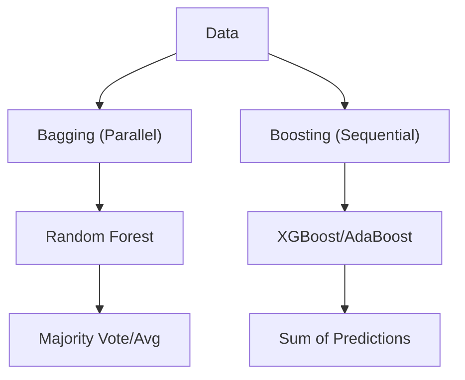

# Ensemble Learning

Ensemble learning combines multiple models to improve performance (e.g., Random Forest, Gradient Boosting).

## 🤝 Ensemble Methods

```mermaid
graph TD
    A["Data"] --> B["Bagging (Parallel)"]
    A --> C["Boosting (Sequential)"]
    B --> B1["Random Forest"]
    C --> C1["XGBoost/AdaBoost"]
    B1 --> D["Majority Vote/Avg"]
    C1 --> E["Sum of Predictions"]
```

---

[⬅️ Back to Home](README.md)
