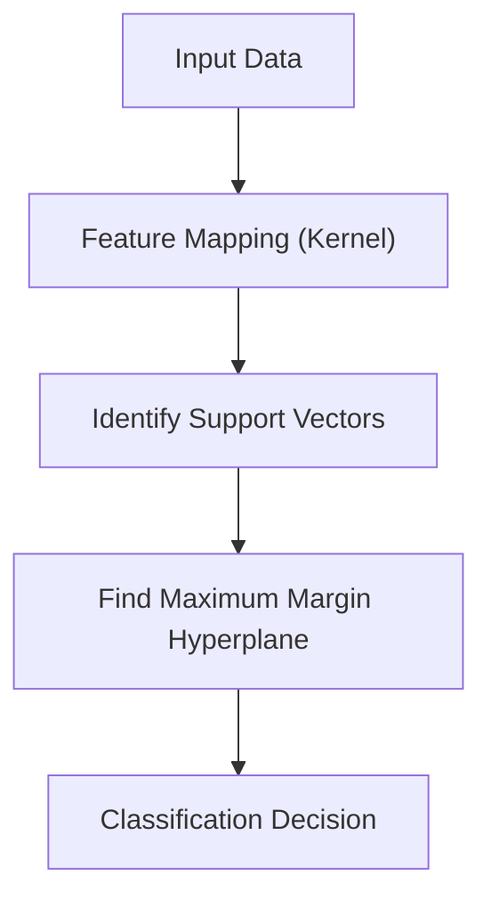

# Support Vector Machine (SVM) is a powerful classification algorithm that finds the hyperplane which best separates different classes.

## 🛡️ SVM: Support Vector Machine

---

[⬅️ Back to Home](README.md)
