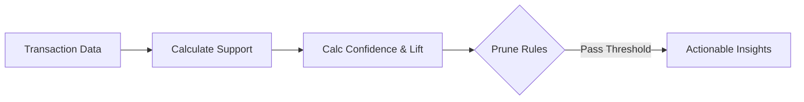

# Association Rules

Association rule learning is used for finding interesting relations between variables in large databases (e.g., Market Basket Analysis).

## 🛒 Association Rule Mining

---

[⬅️ Back to Home](README.md)
