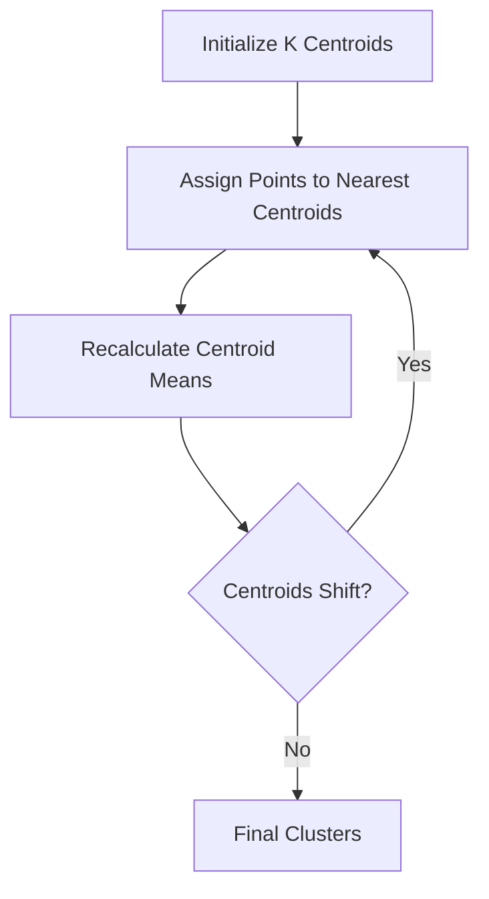

# Clustering

Clustering is an unsupervised learning task that groups similar data points together.

## 🧩 K-Means Clustering Loop

```mermaid
graph TD
    A["Initialize K Centroids"] --> B["Assign Points to Nearest Centroids"]
    B --> C["Recalculate Centroid Means"]
    C --> D{"Centroids Shift?"}
    D -- "Yes" --> B
    D -- "No" --> E["Final Clusters"]
```

---

[⬅️ Back to Home](README.md)
